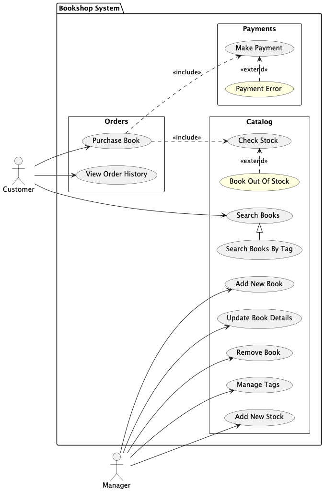
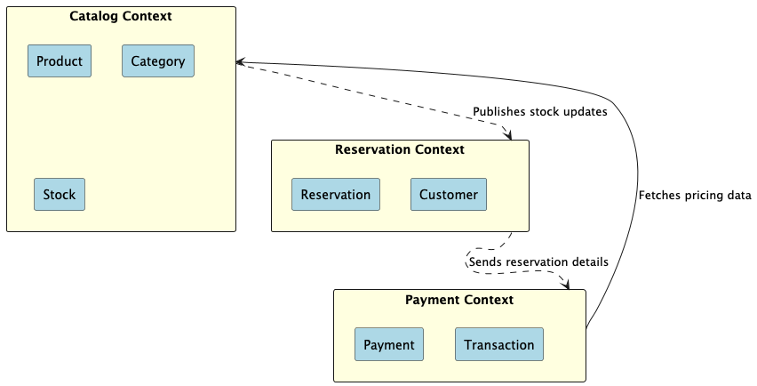

# Architecture

## Use Case Diagrams

### Overview

## Bounded Contexts

### Context Map

The following map illustrates the relationships between the Bounded Contexts in the system.

### Catalog Context

The Catalog Context is responsible for managing the product catalog, including the products, categories, and their stock levels. It ensures accurate and up-to-date information about available products and their pricing.

#### Core Concepts
- **Product:** Represents an item available for reservation or purchase.
- **Category:** Groups products for easier navigation and classification.
- **Stock:** Tracks the availability of a product, ensuring that inventory levels are accurate.

#### Responsibilities
- Manage the creation, updating, and deletion of products and categories.
- Maintain accurate stock levels for all products.
- Provide product and pricing information to other contexts (e.g., Payment Context).
- Notify other contexts about stock level changes through domain events.

#### Integration Points
- **Reservation Context:**
    - Publishes stock availability updates to validate reservation requests.
    - Receives stock adjustment requests from reservations.
- **Payment Context:**
    - Provides product pricing information for payment calculations.

#### Integration Events
- **StockUpdated:** Published when stock levels change due to reservations or adjustments.
- **ProductCreated:** Published when a new product is added to the catalog.
- **ProductUpdated:** Published when product details are modified.

#### Challenges
- Synchronizing stock levels with concurrent reservations and cancellations.
- Handling large catalogs efficiently for quick searches and updates.
- Ensuring pricing information is always accurate across contexts.

### Reservation Context

The Reservation Context manages customer reservations and ensures that inventory is reserved correctly, based on product availability provided by the Catalog Context.

#### Core Concepts
- **Reservation:** Represents a customer's intent to reserve a product or service.
- **Reservation Line:** Individual items within a reservation, including quantity and product details.
- **Customer:** The entity making the reservation.

#### Responsibilities
- Create and manage reservations.
- Validate stock availability during the reservation process.
- Notify other contexts (e.g., Payment) about completed reservations.

#### Integration Points
- **Catalog Context:**
    - Receives stock availability updates to enable reservation validation.
    - Sends notifications about reserved stock.
- **Payment Context:**
    - Triggers payment processing for completed reservations by sending reservation details.

#### Integration Events
- **StockReserved:** Published when stock is successfully reserved.
- **ReservationCreated:** Published when a reservation is created.
- **ReservationCancelled:** Published when a reservation is canceled.

#### Challenges
- Handling concurrent reservations to avoid overbooking.
- Managing cancellations and stock releases in real-time.

### Payment Context

The Payment Context is responsible for processing payments and managing transaction records related to reservations.

#### Core Concepts
- **Payment:** Represents a financial transaction initiated by a customer.
- **Transaction:** Detailed log of payment attempts and outcomes.
- **Invoice:** A formal record of payment issued upon successful completion.

#### Responsibilities
- Process payments securely and ensure transaction integrity.
- Validate payment details provided by customers.
- Maintain a record of all successful and failed transactions.
- Communicate payment outcomes to related contexts (e.g., Reservation).

#### Integration Points
- **Reservation Context:**
    - Receives reservation details to initiate payment processing.
    - Sends payment status updates (success/failure) to finalize reservations.
- **Catalog Context:**
    - Fetches product pricing information during payment processing.

#### Integration Events
- **PaymentInitiated:** Published when a payment process begins.
- **PaymentSucceeded:** Published upon successful payment.
- **PaymentFailed:** Published if a payment attempt fails.

#### Challenges
- Ensuring secure communication with payment gateways.
- Handling retries for failed payments.
- Syncing payment statuses with the Reservation Context in case of failures.

### Integration Between Bounded Contexts

Integration between bounded contexts is handled using domain events and REST APIs.

- **Catalog → Reservation:** Catalog Context publishes stock updates via domain events.
- **Reservation → Payment:** Reservation Context sends reservation details for payment processing.
- **Payment → Catalog:** Payment Context fetches pricing data when processing payments.
