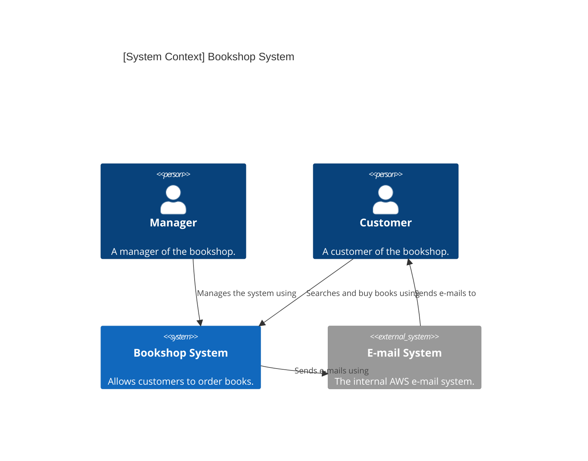

# Architecture Diagrams

## Level 1: System Context

```mermaid
C4Context
    title [System Context] Bookshop System
    
    Person(manager, "Manager", "A manager of the bookshop.")
    Person(customer, "Customer", "A customer of the bookshop.")
    
    System(bookshopSystem, "Bookshop System", "Allows customers to order books.")
    System_Ext(emailSystem, "E-mail System", "The internal AWS e-mail system.")

    Rel(customer, bookshopSystem, "Searches and buy books using")
    Rel(manager, bookshopSystem, "Manages the system using")
    Rel(bookshopSystem, emailSystem, "Sends e-mails using")
    Rel(emailSystem, customer, "Sends e-mails to")

    UpdateLayoutConfig($c4ShapeInRow="2", $c4BoundaryInRow="1")
```
