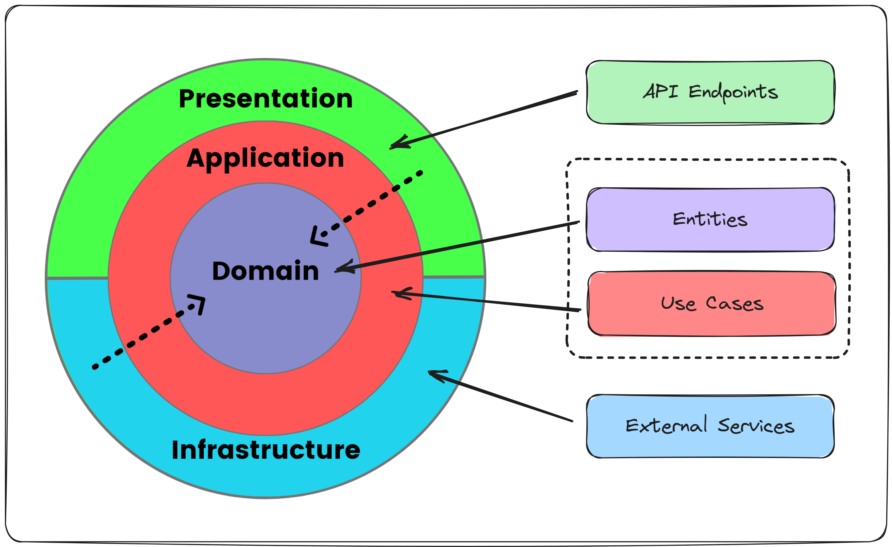

# Architecture Style

## Microservice Backend Architecture

The **Bookshop System** is designed using a **Microservice Backend Architecture**.

This architectural style structures the application as a collection of small, autonomous services, each dedicated to a
specific business capability. Services communicate using lightweight protocols, such as:

- **HTTP/REST** for synchronous communication.
- **Messaging systems** for asynchronous communication.

### Catalog Service

The **Catalog Service** is one of the core services in the Bookshop System.

It is an **Event Sourcing system**
([↗ Event Sourcing by Martin Fowler](https://martinfowler.com/eaaDev/EventSourcing.html)).

It is implemented following the principles of **Clean Architecture**
([↗ Clean Architecture by Robert C. Martin (Uncle Bob)](https://blog.cleancoder.com/uncle-bob/2012/08/13/the-clean-architecture.html)),
emphasizing a clear separation of concerns, maintainability, and scalability by structuring the system around its core
domain logic.

---

## Clean Architecture

**Clean Architecture** emphasizes separation of concerns and ensures independence between high-level policies and
low-level details. The application is structured into the following layers:

1. **Domain Layer**: The core business logic and rules.
2. **Application Layer**: Coordination of use cases and business workflows.
3. **Infrastructure Layer**: External system integrations (e.g., databases, APIs).
4. **Presentation Layer**: User interaction or interface (e.g., REST controllers).

The core business logic is designed to remain completely independent of frameworks, databases, or APIs. This
independence ensures easier testing, better maintainability, and aligns with the principles of **Domain-Driven Design**.
Additionally, it simplifies adapting the system to evolving requirements.
