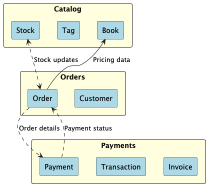
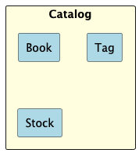

# Bounded Contexts

## Context Map

The following map illustrates the relationships between the bounded contexts in the system. Each bounded context is
aligned with a microservice.

---

## Catalog Context

The Catalog Context is responsible for managing the books, including their categories, and their stock levels. It
ensures accurate and up-to-date information about available books and their pricing.

### Core Concepts

- **Book:** Represents a book available for purchase.
- **Stock:** Tracks the availability of a book, ensuring that inventory levels are accurate.
- **Category:** Groups books for easier navigation and classification.

### Responsibilities

- Manage the creation, updating, and deletion of books and categories.
- Maintain accurate stock levels for all books.
- Provide stock and pricing information to other contexts.

### Integration Points

- **Orders Context:**
    - Publishes stock availability updates to validate order requests.
    - Publishes product pricing information for payment calculations.
    - Receives stock adjustments from orders.

### Integration Events

- **BookCreated:** Published when a new book is added to the catalog.
- **BookUpdated:** Published when book details are modified.
- **StockUpdated:** Published when stock levels change due to reservations or adjustments.

### Challenges

- Synchronizing stock levels with concurrent reservations and cancellations.
- Handling large catalogs efficiently for quick searches and updates.
- Ensuring pricing information is always accurate across contexts.

---

## Orders Context

The Orders Context manages customer orders and ensures that inventory is ordered correctly, based on book availability
provided by the Catalog Context.

### Core Concepts

- **Order:** Represents a customer's intent to order some books.
- **Order Line:** Individual books within an order, including quantity and book details.
- **Customer:** The entity making the order.

### Responsibilities

- Create and manage orders.
- Validate stock availability during the order process.
- Notify other contexts (e.g., Payments) about completed orders.

### Integration Points

- **Catalog Context:**
    - Receives stock availability updates to enable order validation.
    - Sends notifications about ordered stock.
    - Fetches product pricing information.
- **Payments Context:**
    - Triggers payment processing for completed orders by sending order details.

### Integration Events

- **OrderCreated:** Published when an order is created.
- **OrderCancelled:** Published when an order is canceled.
- **OrderCompleted:** Published when stock is successfully ordered.

### Challenges

- Handling concurrent orders to avoid overbuying.
- Managing cancellations and stock releases in real-time.

---

## Payments Context

The Payments Context is responsible for processing payments and managing transaction records related to orders.

### Core Concepts

- **Payment:** Represents a financial transaction initiated by a customer.
- **Transaction:** Detailed log of payment attempts and outcomes.
- **Invoice:** A formal record of payment issued upon successful completion.

### Responsibilities

- Process payments securely and ensure transaction integrity.
- Validate payment details provided by customers.
- Maintain a record of all successful and failed transactions.
- Communicate payment outcomes to related contexts (e.g., Order).

### Integration Points

- **Orders Context:**
    - Receives order details to initiate payment processing.
    - Sends payment status updates (success/failure) to finalize orders.

### Integration Events

- **PaymentInitiated:** Published when a payment process begins.
- **PaymentSucceeded:** Published upon successful payment.
- **PaymentFailed:** Published if a payment attempt fails.

### Challenges

- Ensuring secure communication with payment gateways.
- Handling retries for failed payments.
- Syncing payment statuses with the Orders Context in case of failures.
